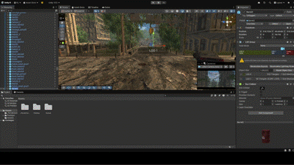

# Escenario 3D - Post-War Environment Study

> **Status:** Open Source / Showcase (2019)
> **Focus:** Level Design, Lighting, Environmental Storytelling
> **Engine:** Unity 3D

Este proyecto es un ejercicio técnico y artístico centrado en la creación de una atmósfera inmersiva post-apocalíptica. El objetivo principal fue dominar el pipeline de iluminación y la composición de escenarios complejos en Unity.

### 🎬 Cinematic Showcase

https://github.com/user-attachments/assets/99091b01-8f49-4669-8ec8-bf8b5e227e57

### 🎨 Aspectos Técnicos (Technical Art)
Más allá de la colocación de objetos, este entorno implementa técnicas de optimización y renderizado:

* **Iluminación y Atmósfera:**
    * Configuración de **Post-Processing Stack** (Bloom, Color Grading, Ambient Occlusion) para lograr el tono desolado.
    * Uso de **Volumetric Fog** para dar profundidad a la escena.
    * Baked Global Illumination (Lightmaps) para optimizar el rendimiento.
* **Level Design:**
    * Diseño de rutas visuales (Leading Lines) para guiar al jugador sin UI.
    * **Environmental Storytelling:** Colocación estratégica de assets (coches abandonados, ruinas) para narrar la historia del lugar sin texto.
* **Optimización:**
    * Implementación de **Occlusion Culling** para no renderizar objetos fuera de cámara.
    * Uso de LODs (Level of Detail) en mallas complejas.

